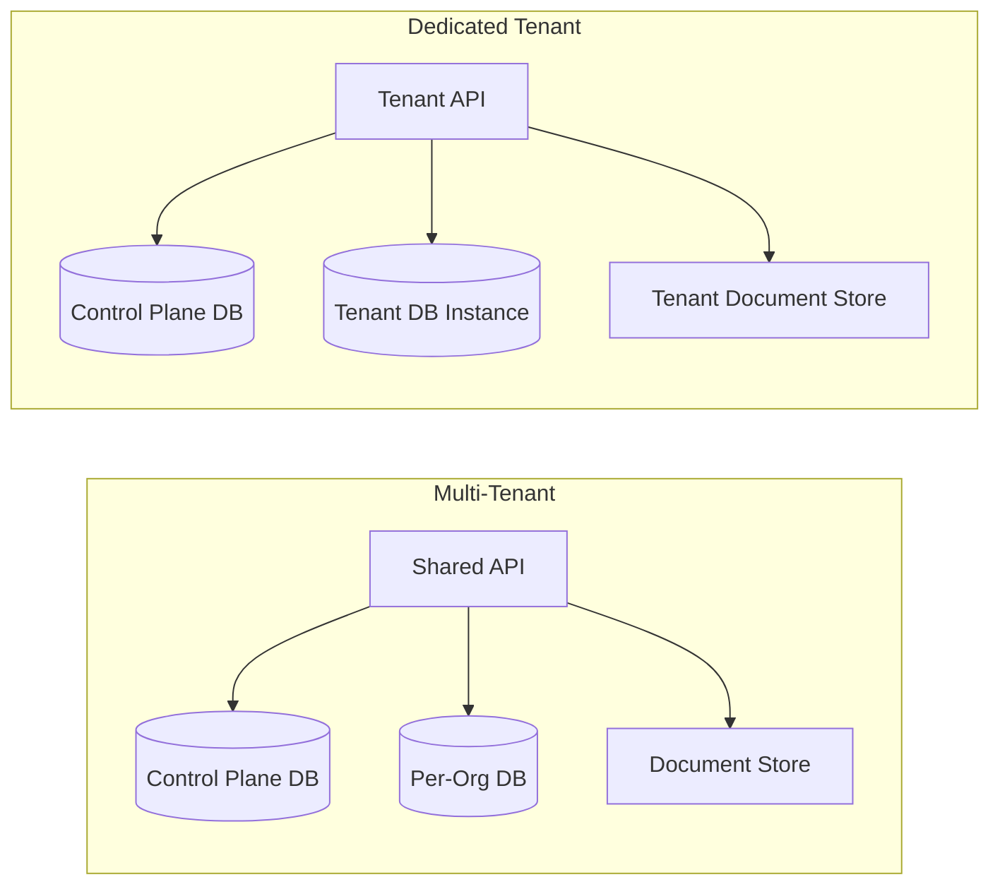

# Blueplane Security Overview

## A Note on Our Pilot Stage

Blueplane is currently in a pilot program. We have designed the platform with security-first architecture from the ground up, and several mature controls are already in production. At the same time, some controls are still being implemented and hardened.

We are actively working toward SOC 2 Type I certification and will share our progress with pilot customers as milestones are reached.

---

## 1. Binary Distribution and Code Signing

### Installation

Blueplane is installed via a shell script downloaded from our GitHub Releases page. The script:

- Downloads the correct pre-built binary
- Verifies the binary's **SHA-256 checksum** against a published checksums file before executing anything
- Places the binary in a user-local directory (`~/.blueplane/bin/`) — no system-wide installation, no elevated privileges required

### Code Signing

| Platform | Signing Method |
| -------- | -------------- |
| **Windows** | Signed via **Microsoft Azure Trusted Signing**|
| **macOS** | Notarization in progress — on our near-term roadmap |
| **Linux** | SHA-256 checksum verification at install time |

Windows signing uses OIDC-based authentication to Azure (no long-lived secrets in CI), and checksums are regenerated and republished after signing so that the published hashes always match the signed artifacts.

---

## 2. What Data Is Collected

Blueplane captures **structured metadata** about AI coding tool sessions. It does not capture the content of files, personal browsing activity, or any activity outside the coding tools it is explicitly installed to observe.

### Collected

| Category | Examples |
| -------- | -------- |
| **Session metadata** | Start/end times, duration, working directory, git branch |
| **Conversation structure** | User prompts, assistant responses, thread identifiers |
| **Tool usage** | Tool name, file paths, search queries, success/failure, timing |
| **Token and model usage** | Model identifier, input/output token counts, service tier |
| **File operation summaries** | File paths read or edited; lines added/removed (diff counts only) |
| **Agent activity** | Agent start/stop, task completion, permission requests, compaction events |
| **Workspace metadata** | Platform version, workspace identifier, conversation title |

### Not Collected

- **File contents** — redacted on-device before any data leaves the machine
- **Secrets, credentials, and environment variables** — the sanitization pipeline scans for and removes these patterns (see [Data Sanitization](#3-data-sanitization-and-content-redaction))
- **User activity outside coding tools** — Blueplane hooks only fire when the installed coding tool triggers them; no OS-level monitoring occurs
- **Personal information beyond identity** — no location data, no device telemetry beyond platform version

---

## 3. Data Sanitization and Content Redaction

### What Is in Place Today

- **File contents are redacted on-device** before being included in any sync batch. The content of files read or edited by the AI tool is never included in telemetry payloads — only file paths and diff summaries (line counts) are transmitted.
- **The sanitization pipeline architecture** is implemented: every row passes through a configurable `Sanitizer` interface in the daemon before being batched for upload. This design allows per-table, per-field redaction rules without changes to the sync pipeline.

---

## 4. Security in Transit

All data in motion between a developer's machine and Blueplane's cloud services is encrypted using industry-standard protocols.

- **All API calls** use HTTPS (TLS 1.2+)
- **S3 uploads** use time-limited presigned URLs (valid for 5 minutes) over HTTPS. The daemon never holds long-lived S3 credentials — upload authorization is granted per-batch by the Cloud Sync API.
- **Batch payloads** are gzip-compressed before transmission, reducing exposure surface and upload size.
- **Temporary S3 objects** are deleted by the server immediately after successful ingest, and a lifecycle policy automatically expires any orphaned objects as a safety net.

---

## 5. Authentication

### User Authentication

Blueplane delegates user authentication entirely to the organization's existing identity provider. No Blueplane-specific passwords are created or managed.

- **Supported providers:** Google Workspace and Microsoft Entra ID (Azure AD)
- **Protocol:** OAuth 2.0 with **PKCE** (Proof Key for Code Exchange), which prevents authorization code interception attacks
- **Token exchange:** The auth code and PKCE verifier are exchanged server-side by the Blueplane API (not in the client). The client never sees the OAuth client secret.
- **Token expiry and refresh:** ID tokens expire after one hour. The daemon refreshes them automatically using a refresh token. If the refresh token is revoked (e.g., the user is offboarded in the identity provider), the device is immediately de-authorized and sync stops.

### Device Registration

Each machine is registered as a distinct device upon first login. The device receives a UUID that is used to scope all subsequent sync operations. Removing a user from the identity provider immediately invalidates their device's refresh token. No device fingerprinting us captured.

---

## 6. Tenant Architecture

Blueplane supports two deployment modes: **multi-tenant** (shared infrastructure) and **dedicated tenant** (isolated infrastructure per organization).

| Aspect | Multi-Tenant | Dedicated Tenant |
| ------ | ------------ | ---------------- |
| **API endpoint** | Shared | Tenant-specific URL |
| **Telemetry database** | Isolated per-org logical DB | Separate physical RDS instance |
| **S3 storage** | Shared bucket, isolated per-org directory paths | Separate bucket, tenant-namespaced |
| **Secrets** | Shared namespace | Tenant-namespaced in Secrets Manager |
| **IAM roles** | Shared infrastructure role | Separate data and infrastructure roles per tenant |
| **Deployment** | Single shared stack | Dedicated CloudFormation stack per tenant |

In both modes, each organization's telemetry data is physically isolated at the database layer. For dedicated tenants this isolation extends to document storage.

---

## 7. Role-Based Access Control (RBAC)

### Application-Level Roles

| Role | Scope | Capabilities |
| ---- | ----- | ------------ |
| **Member** | Own org | Sync data from their devices |
| **Org Admin** | Own org only | View org telemetry data; access admin data endpoints for their org; cannot access other orgs |
| **Super Admin** | All orgs | Access any org's data; used by Blueplane operators only |

### Infrastructure-Level Roles

AWS IAM roles are separated by function with explicit deny policies:

| Role | Grants | Explicitly Denies |
| ---- | ------ | ----------------- |
| **Tenant Data Role** | S3 read/write, Secrets Manager (org secrets), CloudWatch, SSM | All infrastructure management (Lambda, API Gateway, CloudFormation, IAM) |
| **Infrastructure Management Role** | Lambda deploy, API Gateway, CloudFormation | All tenant data (S3 bucket patterns, all 6 secret types) |

This separation means that operational staff with deployment access cannot access customer data, and data access credentials cannot be used to modify infrastructure.

---

## 8. PII Isolation

Personal identifiable information (PII) and telemetry data are stored in **separate databases** with different access patterns.

### Control Plane Database (PII)

A single shared PostgreSQL database holds identity information:

- `users` table: user UUID, email address, OAuth subject identifier, org membership, role, timestamps
- `devices` table: device UUID, user reference, platform, client version, timestamps
- `orgs` table: org UUID, domain, database connection info (encrypted at rest)

### Per-Org Telemetry Databases (No PII)

Each organization's telemetry is stored in a separate database that contains **no email addresses or names**. Telemetry rows reference users and devices only by UUID. 
### Encryption at Rest

- All RDS databases use AWS-managed KMS encryption
- Secrets (OAuth credentials, database connection strings) are stored in AWS Secrets Manager with KMS encryption
- The `db_connection_info` field in the control plane (which contains per-org database credentials) is encrypted at the application layer before being stored

---

## 9. Separation of Data Access and System Configuration

Access roles are designed so that the customer can independently control:

**Data access** — who within the customer's organization can query telemetry data. This is governed by the Tenant Data IAM Role and application-level RBAC (org-admin assignments). The customer's designated admin can manage org-admin assignments without involving Blueplane operators.

---

## 10. Compliance Posture

| Control Area | Current Status |
| ------------ | -------------- |
| Binary code signing (Windows) | ✅ In production (Azure Trusted Signing) |
| Checksum verification at install | ✅ In production |
| OAuth 2.0 + PKCE authentication | ✅ In production |
| Credential file permissions (0600) | ✅ In production |
| TLS for all data in transit | ✅ In production |
| Per-org database isolation | ✅ In production |
| PII / telemetry database separation | ✅ In production |
| KMS encryption at rest | ✅ In production |
| Dedicated tenant infrastructure | ✅ Available |
| Infrastructure / data IAM role separation | ✅ In production |
| File content redaction (on-device) | ✅ In production |
| Full field-level sanitization (secrets, PII patterns) | ✅ In production |
| macOS binary notarization | 🔄 On near-term roadmap |
| SOC 2 Type I | 🔄 Targeting H2 2026 |
| Penetration testing | 🔄 Planned pre-GA |
| Formal security policy documentation | 🔄 In progress |
