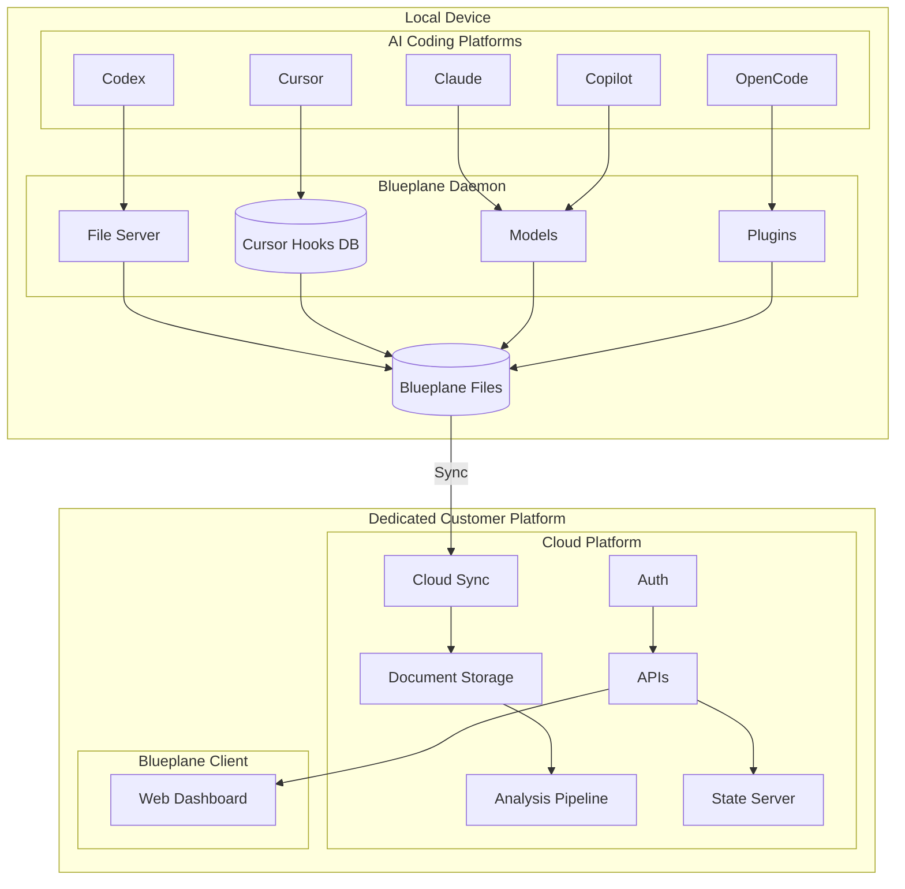
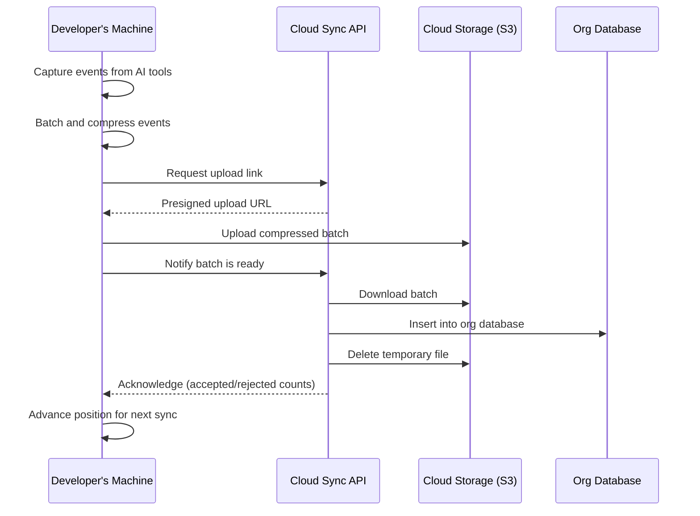

# Blueplane System Overview

This document provides a plain-language overview of the Blueplane platform and how its components work together.

---

## What Is Blueplane?

Blueplane is a platform that helps organizations understand how their teams use AI coding tools such as Claude Code, Cursor, and Codex. It runs quietly in the background on each developer's machine, collects usage data from these tools, and sends it securely to the cloud where it can be analyzed. Blueplane also includes a package manager that lets organizations build and share custom extensions for their AI tools.

---

## Platform Architecture

The following diagram shows how the components on a developer's machine connect to the dedicated customer cloud platform.



---

## The Blueplane Daemon

The **daemon** is a lightweight background program that runs on each developer's machine. Once started, it operates automatically with no day-to-day interaction required.

**What it does:**

- **Captures activity** from supported AI coding tools (Claude Code, Cursor, Codex) using small hook scripts that these tools call during normal use.
- **Processes the data** locally, enriching events with context such as which project a developer was working in.
- **Syncs to the cloud** on a regular schedule (roughly every 30 seconds), uploading batches of data securely to the Blueplane cloud service.
- **Manages itself** -- it starts automatically when the computer boots, restarts if it encounters a problem, and can update itself to the latest version.

The daemon is designed to be invisible during normal use. It consumes minimal memory and writes logs locally for troubleshooting if needed.

---

## Installing Blueplane

Getting Blueplane up and running on a developer's machine takes four steps:

### Step 1: Download and Install

A single command downloads the Blueplane program and places it on the machine:

```
curl -fsSL https://github.com/blueplane-ai/bp-app-releases/releases/download/<version>/blueplane-setup.sh | bash
```

This script automatically detects the operating system (macOS, Linux, or Windows) and processor type, downloads the correct version, and installs it to a local directory. It also sets up the hook scripts that connect Blueplane to each AI coding tool.

### Step 2: Sign In

```
blueplane login
```

This opens a browser window where the developer signs in with their organization's identity provider (Google or Microsoft). Once authenticated, the machine is registered with the organization's Blueplane account.

### Step 3: Start the Daemon

```
blueplane start
```

This registers Blueplane as a background service so it runs automatically. On macOS it uses the system's built-in service manager (launchd); on Linux it uses systemd. From this point on, the daemon starts on login and runs continuously in the background.

### After Installation

Developers can check on the daemon at any time:

| Command             | What it does                                              |
| ------------------- | --------------------------------------------------------- |
| `blueplane status`  | Shows whether the daemon is running                       |
| `blueplane doctor`  | Runs diagnostic checks and reports any issues             |
| `blueplane update`  | Updates Blueplane to the latest version                   |
| `blueplane stop`    | Stops the background service                              |
| `blueplane restart` | Restarts the background service                           |

---

## Data Capture

Blueplane captures structured metadata about AI coding tool usage. This section describes what is collected, and what is explicitly excluded.

### What Is Captured

**Session Information** -- Session start and end times, session duration, current working directory, and git branch name.

**Conversation Data** -- User prompts (the questions and instructions typed), assistant responses (the AI's replies), and conversation thread structure (which messages belong together).

**Tool Usage** -- Tool name (e.g., file read, file edit, shell command, search), tool inputs (file paths, search queries, command names -- file contents are redacted before cloud sync), tool results (success or failure status), and tool execution timing.

**Token and Model Usage** -- Model identifier (e.g., Claude Sonnet 4.6), input tokens consumed, output tokens generated, cache read and cache creation tokens, and service tier.

**File Operations** -- File paths read or edited, lines added and lines removed (diff summary). File content is redacted and not sent to the cloud.

**Agent and Subagent Activity** -- Agent and subagent start/stop events, task completion events, permission requests and approvals, and context compaction events.

**Workspace Metadata** -- Platform version (e.g., Claude Code v1.x), workspace identifier, and conversation name or title.

### What Is Filtered Out

- **File contents** are redacted before leaving the user's machine.
- A **sanitizer** scans for credentials, secrets, and environment variables -- this can be configured per organization.
- **No personal browsing** or activity outside the coding tool is captured.

---

## Cloud Sync

Cloud sync is the mechanism that moves telemetry data from each developer's machine to the organization's cloud account for analysis and reporting.

### How Data Flows



1. **Capture** -- As developers use AI coding tools, small hook scripts record events (such as a session starting, a tool being used, or a prompt being submitted) into local files on the developer's machine.

2. **Batch and Compress** -- The daemon periodically collects these events into a batch, compresses the batch, and prepares it for upload.

3. **Upload to Cloud Storage** -- The daemon requests a secure, time-limited upload link from the Blueplane cloud API, then uploads the compressed batch directly to cloud storage (Amazon S3). This approach keeps the data transfer efficient and avoids overloading the API.

4. **Ingest into Database** -- The daemon notifies the cloud API that a batch is ready. The API downloads the batch from cloud storage, inserts the data into the organization's dedicated database, and removes the temporary file from cloud storage.

5. **Acknowledge** -- The cloud API responds with a summary of how many records were accepted for each data type, and the daemon advances its position so it knows where to pick up next time.

### Security and Privacy

- **Authentication** -- Every sync request requires a valid identity token obtained during the login step. Tokens are refreshed automatically.
- **Organization isolation** -- Each organization's data is stored in a separate database. There is no cross-organization data access.
- **Encrypted transit** -- All data is transmitted over HTTPS.
- **Scoped uploads** -- Each upload is isolated by organization, user, and device, preventing any possibility of data mixing.
- **Automatic cleanup** -- Temporary files in cloud storage expire automatically after a short period, even if the cleanup step fails.

### What Gets Synced

The daemon collects and syncs data from each supported platform:

| Platform    | Data collected                                                     |
| ----------- | ------------------------------------------------------------------ |
| Claude Code | Session transcripts, hook events (tool use, prompts, compactions)  |
| Cursor      | Composer sessions, AI interactions, usage metrics                  |
| Codex       | Session events, tool use                                           |

All data is associated with the developer's identity and device, enabling per-user and per-team reporting.

---

## Blueplane Package Manager (BPM)

For a full overview of the Blueplane Package Manager, see [BPM_OVERVIEW.md](./BPM_OVERVIEW.md).

---

**In short:** Blueplane installs in minutes, runs invisibly in the background, keeps AI tool usage data flowing securely to the cloud, and gives organizations a way to standardize and share AI tool customizations across their teams.
